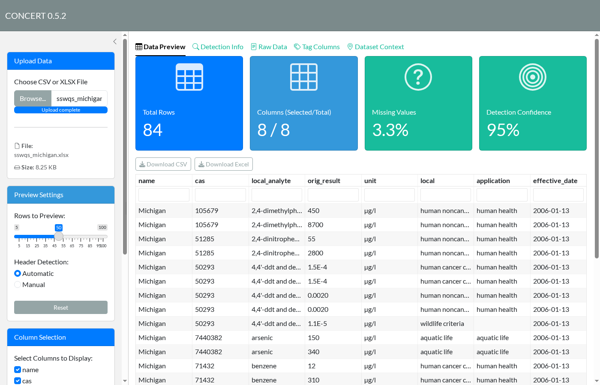
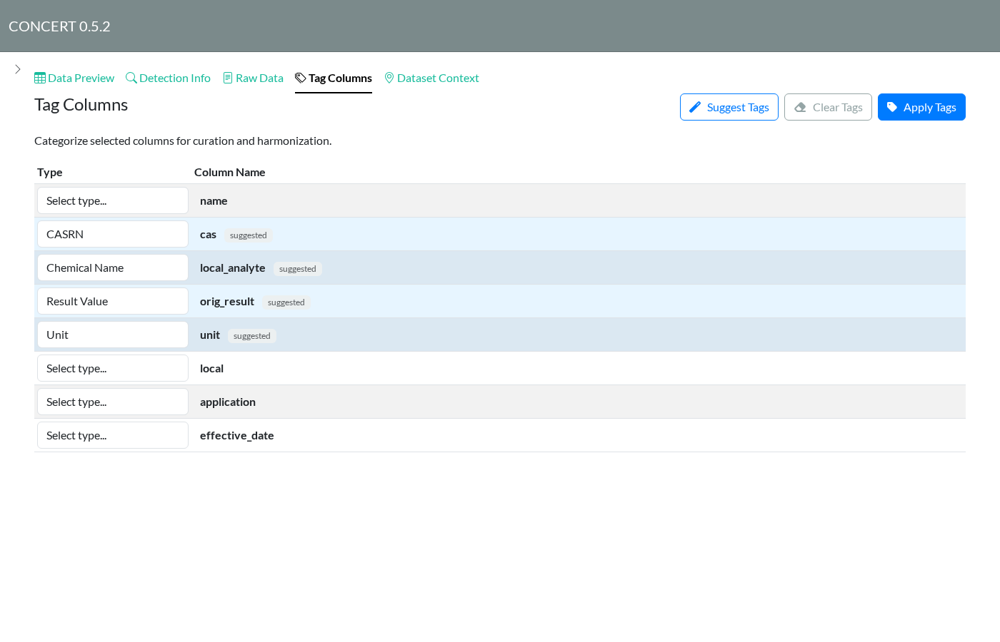
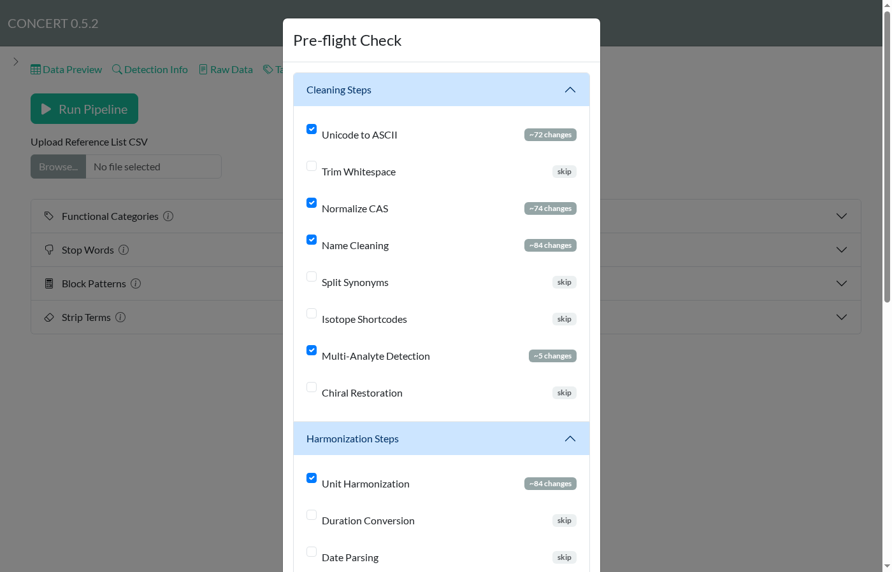
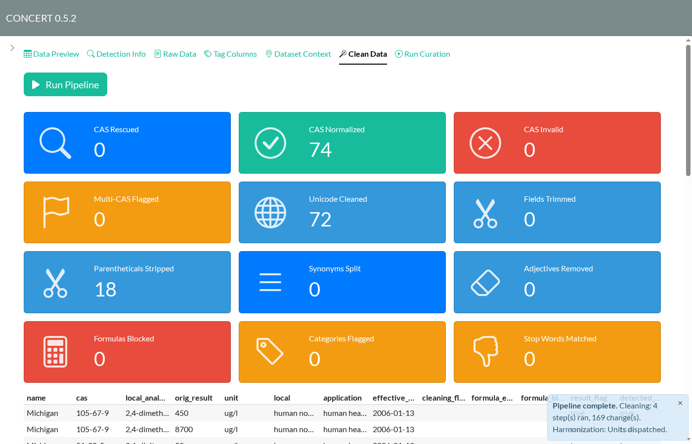
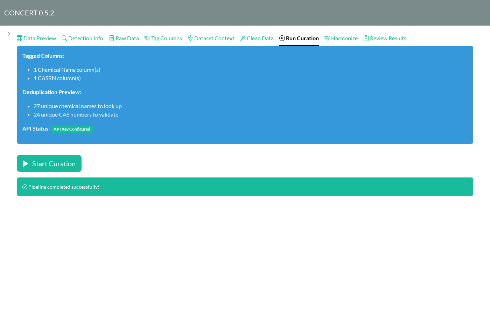
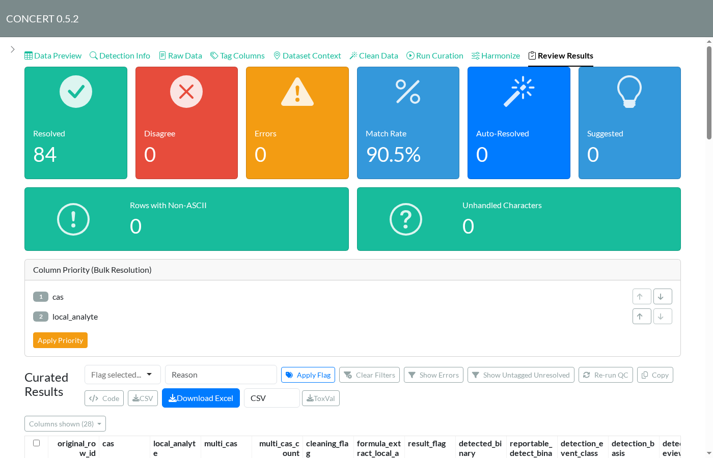
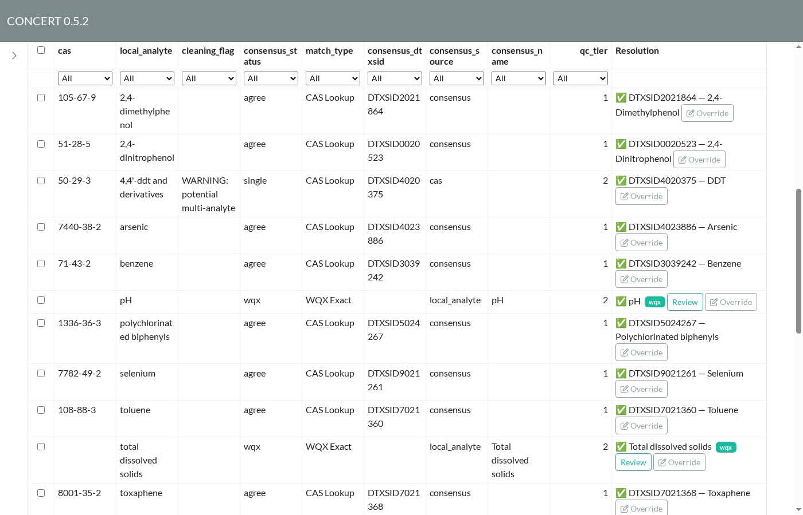
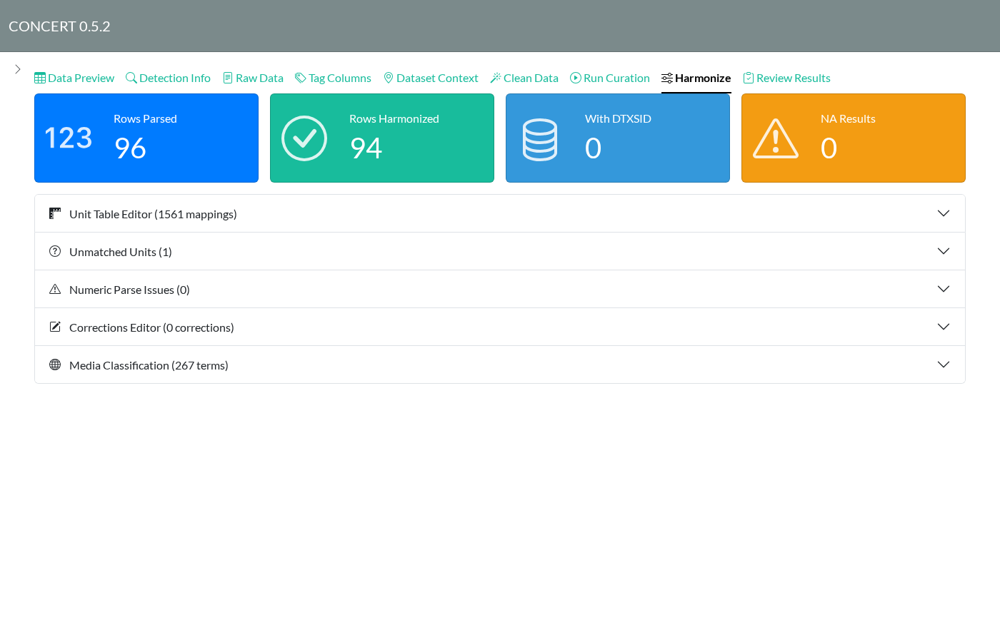

# Curating a dataset in the app

This walkthrough curates the Michigan slice of the state surface water
quality standards (SSWQS) dataset: 84 criteria rows covering 27
chemicals, with CAS numbers stored without hyphens, results in
scientific notation, and a mix of units. Each step below is one tab in
the app. Tabs appear as earlier steps finish.

Start the app:

``` r

concert::run_app()
```

Curation needs network access and a CompTox API key in the `ctx_api_key`
environment variable.

For the current source-DTXSID and mixture-review controls, including the
entire long Override dialog, see [Reviewing a source chemical
identity](https://seanthimons.github.io/concert/articles/source-identity-review.md).
The SSWQS screenshots below illustrate the earlier dataset walkthrough;
the linked guide uses current full-app captures and clearly labelled
synthetic data.

## 1. Upload

Choose a CSV or XLSX file in the sidebar. **Data Preview** shows the
first rows along with row and column counts, the share of missing
values, and how confident CONCERT is about where the data starts. Use
**Column Selection** in the sidebar to drop columns you don’t need.



Data Preview after uploading the Michigan file

## 2. Check header detection

**Detection Info** explains which row was taken as the header and where
the data starts. Three methods vote. If they picked the wrong row, for
example in a report with a title block above the table, switch **Header
Detection** in the sidebar to *Manual* and set the rows yourself.


Detection Info: header on row 1, data from row 2

## 3. Tag columns

**Tag Columns** tells CONCERT what each column holds. Click **Suggest
Tags** to fill in tags guessed from column names and contents;
suggestions are marked *suggested*. Here it picks `local_analyte` as the
chemical name, `cas` as CASRN, `orig_result` as the result, and `unit`
as its unit. Leave columns you don’t need untagged; they still go
through to the export. Every Result column needs a Unit column. Click
**Apply Tags** when you’re done.



Tag Columns with suggested tags

## 4. Clean

On **Clean Data**, click **Run Pipeline**. The pre-flight check
estimates how many rows each step would change and pre-selects the steps
that would do something. Here that means Unicode clean-up (`µg/l`
becomes `ug/l`), CAS normalization, name cleaning, and multi-analyte
detection. Click **Run Checked Steps**.



Pre-flight check

For the complete current pre-flight dialog, including the search
settings and run/cancel buttons below this older capture, see the two
overlapping pre-flight images in [Reviewing a source chemical
identity](https://seanthimons.github.io/concert/articles/source-identity-review.md).

The summary cards count what changed: 74 CAS numbers normalized
(`105679` became `105-67-9`) and 18 parentheticals stripped from names.
The cleaned table below them flags anything that needs a second look.



Clean Data results

## 5. Run curation

**Run Curation** shows what will be looked up. Duplicates are collapsed
first, so 84 rows become 27 names and 24 CAS numbers. Click **Start
Curation**. CONCERT queries CompTox for names and CAS numbers, matches
water-quality parameters against WQX, and scores the candidates. This
dataset takes about 20 seconds.



Run Curation after a successful run

## 6. Review results

**Review Results** is where you check and fix the identities. The cards
at the top count rows that resolved, rows where the name and CAS lookups
disagree, errors, and rows that were resolved automatically or only
suggested.

These cards describe lookup consensus. A resolved lookup is provisional
evidence; it does not establish accepted source identity. **Override**
now also exposes **Source identity correspondence** for an explicit
decision about one source entry. See the linked source-identity guide
for validation, scope and flags.



Review Results summary

Each row in the table has a **Resolution** with a DTXSID and preferred
name. Use **Override** to replace it. `consensus_status` shows how the
resolution was reached:

- `agree`: the name and CAS lookups found the same substance.
- `single`: only one lookup returned a hit. Here,
  `4,4'-ddt and derivatives` only resolved by CAS and was also flagged
  as a possible multi-analyte entry. Check rows like this by hand.
- `wqx`: matched a water-quality parameter such as pH or total dissolved
  solids, which has no DTXSID. **Review** shows the WQX match.

Choose which columns to display with **Columns shown**. To filter to
problem rows, use **Show Errors** and **Show Untagged Unresolved**. To
flag rows, select them, choose a flag and reason, then click **Apply
Flag**.



Review table, showing identity columns

## 7. Harmonize

**Harmonize** reports how numeric results were parsed and how units were
converted. Open **Unmatched Units** and **Numeric Parse Issues** to fix
anything the converter didn’t recognize. Fixes go in **Unit Table
Editor** and **Corrections Editor**. **Media Classification** maps media
terms to the ontology.



Harmonize summary

## 8. Export

Back on **Review Results**, **Download Excel** writes the curated
workbook with audit sheets. **ToxVal** writes ToxVal-format rows as CSV
or Parquet. **Code** shows an R script that replays the session
headlessly.

Upload the workbook using the ordinary file-upload control and choose
**Resume Session** to restore the full review, including source
decisions, evidence and applied cleaning choices. Choose **Treat as Raw
Data** for a fresh workflow. The `Pipeline Config` sheet also supports
sidebar **Import Configuration** when you only want to restore tags and
reference-list edits.

## Updating these screenshots

The screenshots come from `scripts/capture_app_screenshots.R`, which
drives the installed app through the steps above. After UI changes,
reinstall the package and run:

``` r

source("scripts/capture_app_screenshots.R")
capture_app_screenshots()
```

Current source-review screenshots were captured from the running full
app with the collaborative browser and process-local mocked services.
Long dialogs use overlapping scroll captures so their evidence, actions
and footer are included. Capture details are in
`figures/identity-screenshot-capture.md`.
